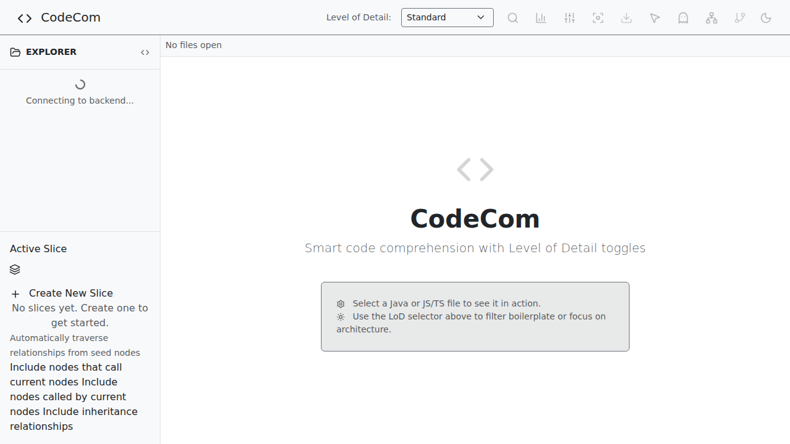
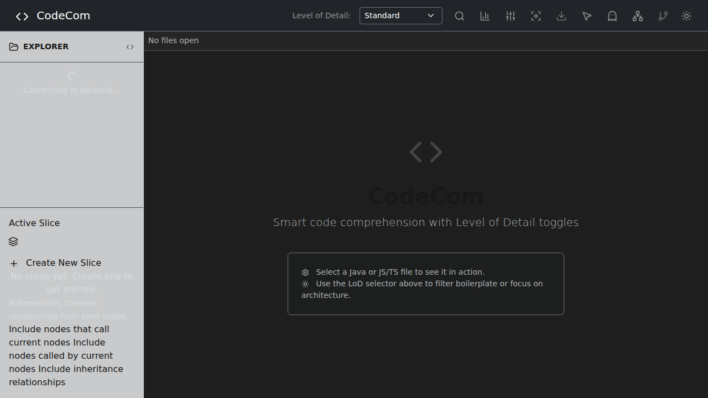

# CodeCom

**A high-performance, web-based code comprehension and visualization tool**

[](STATUS.md)
[](STATUS.md)
[](STATUS.md)

## Overview

CodeCom is designed to reduce cognitive load when exploring large, multi-language codebases by providing intelligent views, smart filtering, and advanced visualizations.

### Key Features

- 🔍 **Intelligent Code Filtering** - Hide comments, imports, and implementation details
- 📊 **Complexity Visualization** - Color-coded heatmap showing file complexity
- 🌐 **Architecture Flow Graph** - Interactive visualization from frontend to database
- 🎯 **Scope Isolation** - Focus on specific methods while dimming surrounding code
- 🔎 **Symbol Search** - Instant project-wide search for classes and methods
- 📈 **Code Statistics** - Comprehensive line counts and structure analysis
- 🎨 **State Machine Diagrams** - Automatic extraction from enums
- 🧩 **Feature Slicing** - Filter codebase by logical feature domains
- 📚 **Knowledge Graph** - Cross-language relationship database
- 📤 **Multi-Format Export** - PDF, Markdown, HTML with configurable detail levels

## Quick Start

```bash
# Clone the repository
git clone https://github.com/lgalvao/codecom.git
cd codecom

# Start both frontend and backend
./dev.sh
```

The application will be available at `http://localhost:5173`.

### Alternative: Separate Installation

**Backend:**
```bash
cd backend
./gradlew bootRun
```

**Frontend:**
```bash
cd frontend
npm install
npm run dev
```

## Documentation

- **[📖 User Manual](USER_MANUAL.md)** - Comprehensive guide with 35 illustrated screenshots
- **[📋 Software Requirements](SRS.md)** - Complete specification (41 functional requirements)
- **[✅ Implementation Status](STATUS.md)** - Current status and test coverage
- **[⚡ Flow Graph Guide](FLOW_GRAPH_GUIDE.md)** - Detailed flow graph usage
- **[🤖 Agent Guidelines](AGENTS.md)** - Development guidelines for AI agents

## Technology Stack

### Frontend
- Vue 3.5 (Composition API)
- TypeScript
- Vite
- BootstrapVueNext
- Shiki (syntax highlighting)
- Web-Tree-Sitter

### Backend
- Spring Boot 4
- Java 25
- Spring Data JPA
- H2 Database (file-based)

## Supported Languages

- **Programming**: Java, JavaScript, TypeScript
- **Database**: SQL, PL/SQL
- **Markup**: HTML, CSS, XML, JSF
- **Configuration**: YAML, Log Files

## Architecture

CodeCom follows a modern full-stack architecture:

```
┌─────────────┐     HTTP/REST      ┌─────────────┐
│   Vue 3.5   │ ←──────────────→  │ Spring Boot │
│  Frontend   │                    │   Backend   │
└─────────────┘                    └──────┬──────┘
                                          │
                                    ┌─────▼──────┐
                                    │ H2 Database│
                                    └────────────┘
```

## Testing

**Frontend Tests:**
```bash
cd frontend
npm run test              # Run unit tests
npm run test:coverage     # With coverage report
npm run test:e2e          # Run E2E tests with Playwright
```

**Backend Tests:**
```bash
cd backend
./gradlew test            # Run all tests
./gradlew jacocoTestReport # Generate coverage report
```

**Current Coverage:**
- Frontend: 83% (Vitest + Playwright)
- Backend: 75% (JUnit 6 + JaCoCo)

## Project Status

✅ **100% Feature Complete** - All 41 functional requirements implemented

See [STATUS.md](STATUS.md) for detailed implementation tracking.

## Screenshots


*Welcome screen with light theme*


*Welcome screen with dark theme*

See the [User Manual](USER_MANUAL.md) for 35+ annotated screenshots covering all features.

## Contributing

We welcome contributions! Please see [AGENTS.md](AGENTS.md) for development guidelines.

### Development Workflow

1. Fork the repository
2. Create a feature branch
3. Make your changes
4. Run tests: `npm run test` (frontend) and `./gradlew test` (backend)
5. Submit a pull request

## License

This project is part of a code comprehension research initiative.

## Support

- **Documentation**: See [USER_MANUAL.md](USER_MANUAL.md) for comprehensive usage guide
- **Issues**: Report bugs via GitHub Issues
- **Discussions**: Ask questions in GitHub Discussions

## Acknowledgments

CodeCom implements cutting-edge code comprehension techniques including:
- Complexity-controlled views with Level of Detail abstraction
- Cross-language knowledge graph database
- Interactive architecture flow visualization
- Automatic state machine extraction
- Feature-based code slicing

---

**CodeCom** - Making code comprehension effortless.

*Version 1.0 | February 2026*
